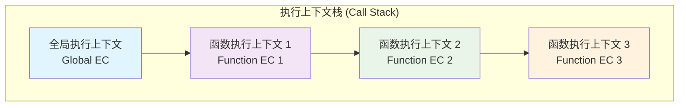
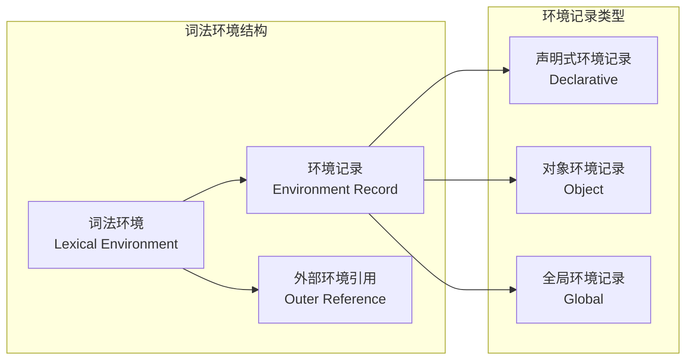
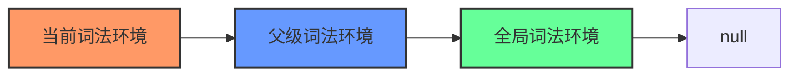
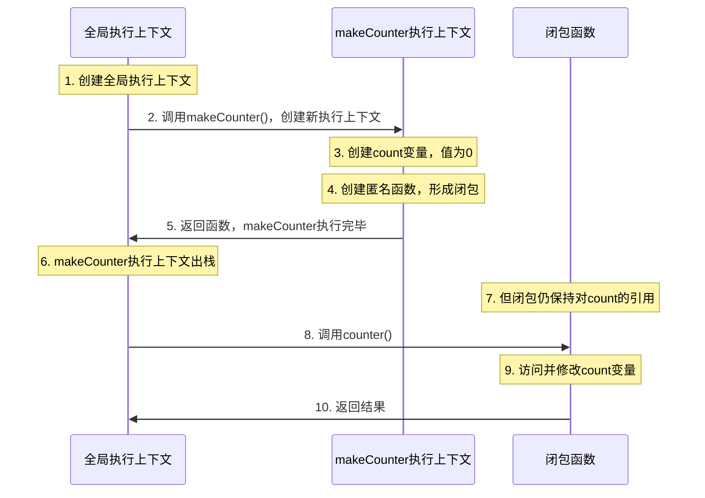

## 什么是闭包

闭包是 JavaScript 中最强大且独特的特性之一，它是**函数与其词法环境的组合**。闭包使得函数能够`访问其外部作用域`的变量，即使外部函数已经执行完毕。这种机制让 JavaScript 具备了许多其他语言需要复杂语法才能实现的功能。

```javascript
// 最简单的闭包示例
function outer() {
  const message = "Hello from outer!"; // 外部变量
  function inner() {
    console.log(message); // inner函数"记住"了message
  }

  return inner; // 返回inner函数
}

const myClosure = outer();
myClosure(); // "Hello from outer!"
```

## 核心概念与前置知识

### 执行上下文

`执行上下文`是 JavaScript 代码执行时的环境，每当代码执行时都会创建对应的执行上下文。



执行上下文的组成部分：

```javascript
// 伪代码：执行上下文的内部结构
ExecutionContext = {
  // 1. 词法环境 (用于let/const和函数声明)
  LexicalEnvironment: {
    EnvironmentRecord: {}, // 环境记录
    outer: null            // 外部环境引用
  },

  // 2. 变量环境 (用于var声明)
  VariableEnvironment: {
    EnvironmentRecord: {},
    outer: null
  },

  // 3. this绑定
  ThisBinding: undefined
}
```

### 词法环境

`词法环境`是存储标识符-变量映射的结构，由环境记录和外部环境引用组成。



词法环境的创建过程：

```javascript
function createLexicalEnvironment() {
  // 示例：词法环境的创建
  function outer(x) {
    let a = 10;
    const b = 20;

    function inner(y) {
      let c = 30;
      console.log(a + b + c + x + y); // 访问多个作用域的变量
    }

    return inner;
  }

  return outer;
}

// 执行过程中的词法环境变化
/*
1. 全局词法环境:
{
  EnvironmentRecord: {
    createLexicalEnvironment: <function>,
    outer: <function>
  },
  outer: null
}

2. outer函数的词法环境:
{
  EnvironmentRecord: {
    x: 参数值,
    a: 10,
    b: 20,
    inner: <function>
  },
  outer: <全局词法环境的引用>
}

3. inner函数的词法环境:
{
  EnvironmentRecord: {
    y: 参数值,
    c: 30
  },
  outer: <outer函数词法环境的引用>
}
*/
```

### 作用域链

`作用域链`是通过词法环境的外部引用形成的链条，用于标识符解析。



作用域链查找示例：

```javascript
function demonstrateScopeChain() {
  const globalVar = "全局变量";
  function level1() {
    const level1Var = "第一层变量";
    function level2() {
      const level2Var = "第二层变量";
      function level3() {
        const level3Var = "第三层变量";
        // 变量查找顺序演示
        console.log(level3Var); // 1. 在当前环境找到
        console.log(level2Var); // 2. 向上一层查找
        console.log(level1Var); // 3. 继续向上查找
        console.log(globalVar);  // 4. 查找到全局环境
        // console.log(nonExistent); // 5. 找不到则报错
      }
      return level3;
    }
    return level2;
  }
  return level1;
}

// 调用过程中的作用域链
const fn = demonstrateScopeChain()()();
fn(); // 执行时会沿着作用域链查找变量
```

## 代码示例与分析

### 经典的闭包示例

```javascript
function makeCounter() {
  let count = 0; // 外部函数的局部变量

  return function() { // 返回的内部函数形成闭包
    count++; // 访问外部函数的变量
    return count;
  };
}

const counter = makeCounter(); // 调用外部函数
console.log(counter()); // 1 - 调用闭包函数
console.log(counter()); // 2 - count 变量被保持
console.log(counter()); // 3
```

### 逐行执行过程分析



**详细步骤解析：**

```javascript
// 步骤 1-2: 全局执行上下文创建，调用makeCounter
function makeCounter() {
  // 步骤 3: 在makeCounter的词法环境中创建count变量
  let count = 0;

  // 步骤 4: 创建匿名函数，该函数的[[Environment]]属性
  // 指向makeCounter的词法环境，形成闭包
  return function() {
    // 步骤 9: 通过作用域链找到外部的count变量
    count++;
    return count;
  };
  // 步骤 5-6: makeCounter执行完毕，执行上下文出栈
  // 但count变量因为被闭包引用而不会被垃圾回收
}

// 步骤 7: counter变量保存了闭包函数的引用
const counter = makeCounter();

// 步骤 8-10: 每次调用counter()都会访问保存的count变量
console.log(counter()); // 1
```

### V8 引擎的优化

V8 引擎对闭包进行了以下优化：

1. **变量提升优化**：只保留被闭包实际使用的外部变量
2. **内存管理**：未被引用的外部变量会被垃圾回收
3. **作用域分析**：在编译时分析变量使用情况

```javascript
function optimizationExample() {
  let used = "被闭包使用的变量";
  let unused = "未被使用的变量"; // V8会优化掉这个变量
  let alsoUnused = "同样未被使用";

  return function() {
    console.log(used); // 只有这个变量会被保留在闭包中
  };
}
```

**注意**：在调试时，由于 V8 的优化，某些未使用的变量可能在调试器中显示为 "undefined"。

## 应用场景与最佳实践

### 模块化封装

```javascript
const Calculator = (function() {
  let result = 0; // 私有变量

  return {
    add: function(x) {
      result += x;
      return this;
    },
    multiply: function(x) {
      result *= x;
      return this;
    },
    getResult: function() {
      return result;
    },
    reset: function() {
      result = 0;
      return this;
    }
  };
})();

// 使用
Calculator.add(5).multiply(2).getResult(); // 10
```

### 事件处理与回调

```javascript
function createButtonHandler(name) {
  return function(event) {
    console.log(`按钮 ${name} 被点击了`);
    // name变量被闭包保存
  };
}

document.getElementById('btn1').onclick = createButtonHandler('按钮1');
document.getElementById('btn2').onclick = createButtonHandler('按钮2');
```

### 防抖和节流

```javascript
// 防抖函数
function debounce(func, delay) {
  let timeoutId; // 被闭包保存的变量

  return function(...args) {
    clearTimeout(timeoutId);
    timeoutId = setTimeout(() => {
      func.apply(this, args);
    }, delay);
  };
}

// 节流函数
function throttle(func, delay) {
  let lastCall = 0;

  return function(...args) {
    const now = Date.now();
    if (now - lastCall >= delay) {
      lastCall = now;
      func.apply(this, args);
    }
  };
}
```

## 常见陷阱与解决方案

### 循环中的闭包陷阱

**问题代码：**

```javascript
// 经典错误示例
for (var i = 0; i < 3; i++) {
  setTimeout(function() {
    console.log(i); // 输出三次 3
  }, 100);
}
```

**解决方案：**

```javascript
// 方案1：使用IIFE创建新的作用域
for (var i = 0; i < 3; i++) {
  (function(j) {
    setTimeout(function() {
      console.log(j); // 输出 0, 1, 2
    }, 100);
  })(i);
}

// 方案2：使用let块级作用域（推荐）
for (let i = 0; i < 3; i++) {
  setTimeout(function() {
    console.log(i); // 输出 0, 1, 2
  }, 100);
}

// 方案3：使用bind
for (var i = 0; i < 3; i++) {
  setTimeout(function(j) {
    console.log(j); // 输出 0, 1, 2
  }.bind(null, i), 100);
}
```

### 内存泄漏风险

```javascript
// 可能导致内存泄漏的代码
function createHandler() {
  const largeData = new Array(1000000).fill('data'); // 大量数据

  return function() {
    // 即使不使用largeData，它也会被闭包保留
    console.log('handler called');
  };
}

// 解决方案：显式释放不需要的引用
function createHandler() {
  const largeData = new Array(1000000).fill('data');
  const needed = largeData.slice(0, 10); // 只保留需要的部分

  return function() {
    console.log(needed.length);
    // largeData会被垃圾回收
  };
}
```

## 总结

闭包的核心要点：

1. **定义**：闭包是函数与其词法环境的组合
2. **原理**：通过作用域链访问外部变量
3. **特性**：外部函数执行完毕后，变量仍被保留
4. **应用**：模块化、事件处理、防抖节流等
5. **注意**：避免循环陷阱和内存泄漏

理解闭包是掌握 JavaScript 高级特性的关键，它在实际开发中有着广泛的应用。
